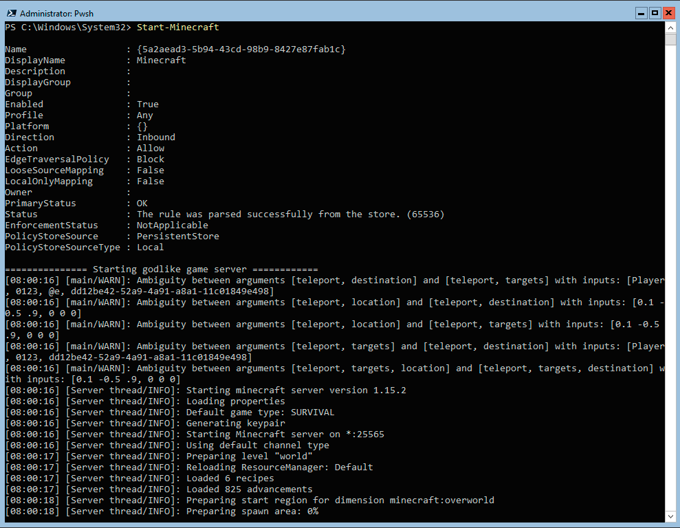

# PSMinecraft

The **PSMinecraft** is Powershell 7  management modules for minecraft server.

## Installation

### From Source

To manually install the module,
download the source code and unzip the contents to the directory
'$env:ProgramFiles\PowerShell\7\Modules'.

## Requirements

* The minimum Windows Management Framework (PowerShell) version required is 7.0.0
or higher.

## List of commands
The following is a list of commands which are available for you to use once you follow the steps in Installation

|Command|Description|
|-------|-----------|
|[Approve-MinecraftEULA](/Approve-MinecraftEULA) | Accept minecraft Server EULA in certain directory.|
|[Start-Minecraft](/Start-Minecraft)  | Handler script. Automatically restarts server, provide alternative logging. |
|[Register-Minecraft](/Register-Minecraft)  | Another way to add script to schedules tasks. |
|[Start-MinecraftWebListener](/Start-MinecraftWebListener)  | Addon for Start-Minecraft module. This module is listening for paypal IPN notifications. |

## Examples

You can review the directorier for some general use
scenarios for all of the resources that are in the module.

## Change log

A full list of changes in each version can be found in the [change log](CHANGELOG.md).
